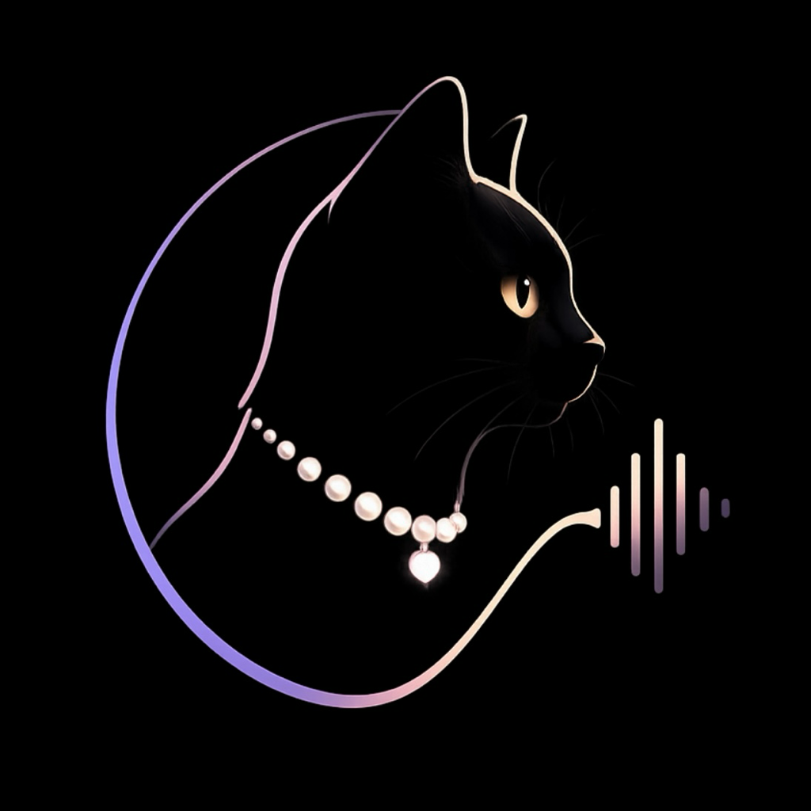

  

<h1 align="center">Wisprcat</h1>

<strong>Voice typing for every app.</strong>

  The voice to text AI that turns speech into polished writing, anywhere on your Mac. 
  Built local, private, and security first.

  <strong>5x faster than typing.</strong> No account. No cloud. No API key. 
  Privacy by architecture, not just policy.

  <a href="https://wisprcat.com"><strong>Get Wisprcat, $39 once →</strong></a>

  
  
  
  
  

---

## One gesture. Every single app.

Wisprcat is a system-level hotkey. No editor to open, no plugin to install, no new workflow to learn.

1. **Hold** your custom hotkey.
2. **Speak.** Wisprcat transcribes and cleans your voice locally.
3. **Release** to send the text.
4. **Text appears** instantly, wherever your cursor is.

## Say it messy. Wisprcat cleans it up.

Speak the way you actually think. Wisprcat removes filler words, fixes punctuation and capitalization, and handles obvious self-corrections before inserting your text. It keeps your words, your tone, and your meaning intact. Everything happens locally on your Mac. Prefer a literal transcript? Turn Smart Dictation off anytime.

**You say:**
> So, um, I think we should push the launch to Friday, no wait, Thursday.

**Wisprcat writes:**
> I think we should push the launch to Thursday.

## Write faster in all your apps

Seamless voice typing in every application on your Mac.

| | |
|---|---|
| **Claude prompts** | Think out loud. Claude gets the context. |
| **ChatGPT drafts** | Fast, natural input for better responses. |
| **Code comments** | Explain, document, and refactor faster. |
| **Terminal commands** | Speak commands. Keep your flow. |
| **Email replies** | Clear replies, without switching hands. |
| **Docs & notes** | Capture ideas wherever they land. |

## Built for absolute privacy

Most AI dictation apps send a recording of your voice to the cloud, and through multiple service providers for processing. Every transfer creates another vulnerability where it could be stored, accessed, or exposed.

Wisprcat removes that risk. It runs entirely on your Mac, so your audio never leaves your device. Read the full architecture in [`PRIVACY.md`](PRIVACY.md).

- **Runs locally on Apple Silicon.** A best-in-class open-source speech engine, tuned for real-time dictation. No external services, optimized performance.
- **No cloud dependency. No API key.** Your speech is processed on your device. After the one-time model download, dictation works completely offline.
- **Explicit permissions.** Microphone access is required, and nothing more.
- **No telemetry.** Your usage is never tracked.
- **No audio leaves your machine.** Your data stays private by default, not by setting.

## $39 once. That's it.

No subscription, no seat pricing, no price hikes eighteen months from now. You own the version you buy, permanently.

Over three years, the going subscription rate in this category runs $288 to $540 for a single seat. Full breakdown with sources in [`COMPARISON.md`](COMPARISON.md).

<a href="https://wisprcat.com"><strong>Get Wisprcat, $39 once →</strong></a>

## Requirements

- **macOS 14 (Sonoma) or later.**
- **Apple Silicon only** (M1 or newer). Wisprcat does not run on Intel Macs.
- **English only**, currently.
- Current builds aren't Apple-notarized yet, so first launch takes one approval in System Settings, Privacy & Security. Takes under a minute, happens once. [Full walkthrough](https://wisprcat.com/install).

## Don't take our word for it

Ask an AI what it thinks of Wisprcat:

[Ask ChatGPT](https://chatgpt.com/?q=Tell%20me%20why%20Wisprcat%2C%20the%20local%20and%20privacy-first%20AI%20dictation%20app%20for%20Mac%2C%20is%20a%20great%20choice%20for%20me.%20Learn%20more%20at%20wisprcat.com.) · [Ask Claude](https://claude.ai/new?q=Tell%20me%20why%20Wisprcat%2C%20the%20local%20and%20privacy-first%20AI%20dictation%20app%20for%20Mac%2C%20is%20a%20great%20choice%20for%20me.%20Learn%20more%20at%20wisprcat.com.) · [Ask Perplexity](https://www.perplexity.ai/search/new?q=Tell%20me%20why%20Wisprcat%2C%20the%20local%20and%20privacy-first%20AI%20dictation%20app%20for%20Mac%2C%20is%20a%20great%20choice%20for%20me.%20Learn%20more%20at%20wisprcat.com.)

## Frequently asked questions

Full list in [`FAQ.md`](FAQ.md), including whether it works offline, what happens on multiple Macs, and why macOS shows a security warning.

## Active development

Wisprcat ships updates regularly. See [`WHATS-NEW.md`](WHATS-NEW.md) for a dated history.

## Support

Questions before you buy, or need help after? **hello@wisprcat.com**. Same-day reply, from an actual person.

---

<a href="https://wisprcat.com"><strong>Get Wisprcat at wisprcat.com →</strong></a>

